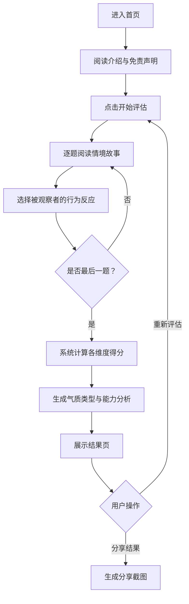

# 产品需求文档 (PRD) — 气质洞察

## 1. 产品概述

「气质洞察」是一款基于情境行为观察法的性格与能力评估工具。用户以观察者身份，通过选择被观察者在真实事件情境中的行为反应，系统将基于心理学理论模型进行多维度分析，最终给出客观的性格气质与能力倾向判断。

- **核心价值**：帮助用户以一种结构化、非标签化的方式，理解他人或自己的行为模式与气质倾向，促进自我探索与人际理解。
- **目标用户**：对心理学感兴趣的普通用户、HR从业者、教育工作者、团队管理者，以及任何想要通过客观行为观察深入了解他人或自我的人。

## 2. 核心功能

### 2.1 功能模块

1. **首页**：品牌展示、产品介绍、免责声明、开始评估入口
2. **评估页**：情境故事展示、行为选项选择、进度追踪
3. **结果页**：气质维度分析、能力雷达图、综合文字解读、重新评估入口

### 2.2 页面详情

| 页面名称 | 模块名称 | 功能描述 |
|---------|---------|---------|
| 首页 | 品牌区 | 应用名称"气质洞察"、品牌Slogan、深海紫罗兰渐变背景、柔和微动效 |
| 首页 | 介绍区 | 评估方式说明卡片（观察者视角、真实情境、客观判断），莫兰迪配色 |
| 首页 | 免责声明 | 显眼的免责声明："本应用仅供自我探索和娱乐参考，不构成专业心理评估或医疗建议。" |
| 首页 | 行动区 | "开始评估"主按钮，全圆角，带弹性点击动效 |
| 评估页 | 进度条 | 顶部进度条显示当前评估进度，带平滑过渡动画 |
| 评估页 | 情境卡片 | 真实事件情境描述，卡片式呈现，大圆角20px，玻璃态效果 |
| 评估页 | 选项列表 | 4个行为选项，每个选项映射不同气质和能力维度，选中态高亮 |
| 评估页 | 导航区 | 上一题/下一题按钮，支持回退修改 |
| 结果页 | 气质概览 | 主导气质类型展示（多血质/胆汁质/黏液质/抑郁质），气质专属配色，动物意象图 |
| 结果页 | 能力雷达图 | 六维能力雷达图（沟通力/领导力/创造力/分析力/抗压力/同理心），交互动效 |
| 结果页 | 综合解读 | 非标签化的文字解读，强调倾向性和可塑性，温和专业语气 |
| 结果页 | 维度详情 | 各维度得分详情卡片，展开式阅读 |
| 结果页 | 操作区 | "重新评估"按钮、"分享结果"按钮 |

## 3. 核心流程

## 4. 用户界面设计

### 4.1 设计风格

- **主色调**：深海紫罗兰色系 `#5B4FCF` → `#7B6FE0`（品牌主色），搭配莫兰迪配色（灰粉、灰蓝、灰绿、暖灰）用于卡片和背景
- **气质专属色**：多血质-暖橙 `#E8A87C`，胆汁质-赤红 `#D96459`，黏液质-静谧蓝 `#6B9AC4`，抑郁质-深紫灰 `#8E7CC3`
- **按钮样式**：全圆角（border-radius: 50px），带微渐变和柔和阴影，点击时弹性缩放（scale 0.95 → 1.0）
- **字体**：标题使用圆体无衬线字体（Nunito / 系统圆体），正文行高 1.6-1.8，字号 ≥ 15px，重要数据大字号 + 600 字重
- **卡片样式**：border-radius 20px，hover 时向上移动 4px，玻璃态效果 backdrop-filter: blur(10px)
- **动效**：过渡动画 300ms ease-out，页面加载时交错淡入上移动画，按钮弹性缩放，雷达图绘制动画
- **图标**：简约线性图标，统一使用气质专属色系

### 4.2 页面设计概览

| 页面名称 | 模块名称 | UI 元素 |
|---------|---------|--------|
| 首页 | 品牌区 | 深海紫罗兰渐变背景，大标题"气质洞察"居中，副标题，微妙浮动粒子动效 |
| 首页 | 介绍区 | 三张莫兰迪色系卡片横向排列，图标+文字，玻璃态，hover 上移 |
| 首页 | 免责声明 | 浅色背景圆角条，感叹号图标 + 文字，居中显示 |
| 首页 | 行动区 | 全圆角大按钮，紫罗兰渐变，白色文字，弹性动效 |
| 评估页 | 进度条 | 顶部固定，圆角进度条，当前进度百分比显示，渐变色填充 |
| 评估页 | 情境卡片 | 大卡片，柔光背景，情境文字 16px 1.7 行高，可选添加情境emoji |
| 评估页 | 选项列表 | 4个选项卡片纵向排列，左侧序号圆圈，选中态边框变色+背景微变色 |
| 评估页 | 导航区 | 底部固定，上一题（次要按钮）+ 下一题（主按钮），间距合理 |
| 结果页 | 气质概览 | 顶部大卡片，气质名称+专属色+动物意象图，渐变背景 |
| 结果页 | 能力雷达图 | Recharts 雷达图，6维，渐变色填充，绘制动画，居中 |
| 结果页 | 综合解读 | 圆角卡片，分段落文字，温和语气，行高 1.8 |
| 结果页 | 维度详情 | 折叠卡片列表，点击展开，每项含维度名+得分+简述 |
| 结果页 | 操作区 | 底部两个按钮并排，重新评估（轮廓按钮）+ 分享（主按钮） |

### 4.3 响应式设计

- 桌面端优先设计，最大内容宽度 480px 居中，模拟移动端卡片体验
- 移动端全宽自适应，卡片边距 16px
- 触摸交互优化：按钮最小点击区域 44px，选项卡片整行可点击

## 5. 评估模型设计

### 5.1 气质四类型

基于希波克拉底气质类型理论，四大维度：

| 气质类型 | 核心特征 | 专属色 |
|---------|---------|--------|
| 多血质 | 活泼外向、反应迅速、喜欢交际、注意力易转移 | 暖橙 |
| 胆汁质 | 精力旺盛、直率热情、情绪易激动、行动果断 | 赤红 |
| 黏液质 | 安静稳重、善于忍耐、情绪不易外露、注意力稳定 | 静谧蓝 |
| 抑郁质 | 敏感细腻、观察力强、体验深刻、行动迟缓谨慎 | 深紫灰 |

### 5.2 能力六维度

| 能力维度 | 描述 |
|---------|------|
| 沟通力 | 表达清晰度、倾听能力、人际互动 |
| 领导力 | 影响力、决策力、团队激励 |
| 创造力 | 创新思维、想象力、灵活应变 |
| 分析力 | 逻辑推理、问题拆解、系统性思考 |
| 抗压力 | 情绪稳定性、逆境应对、自我调节 |
| 同理心 | 共情能力、换位思考、情感理解 |

### 5.3 评分机制

- 共 20 道情境题，每道题 4 个选项，每个选项在不同维度上有不同权重
- 累计各维度得分，按百分比计算最终各维度倾向
- 气质类型取最高分维度，能力雷达图展示六维得分百分比