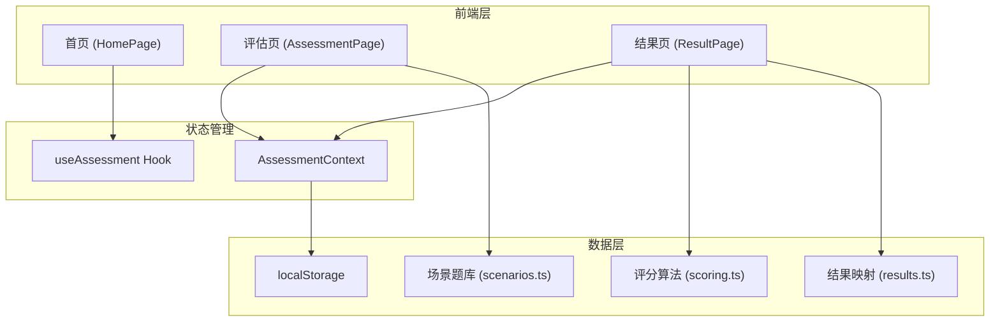

# 技术架构文档 — 气质洞察

## 1. 架构设计



## 2. 技术选型

- **前端框架**：React 18 + TypeScript
- **构建工具**：Vite
- **样式方案**：Tailwind CSS 3 + 自定义 CSS 变量
- **图表库**：Recharts（雷达图）
- **路由**：React Router v6
- **状态管理**：React Context + useReducer
- **数据持久化**：localStorage
- **后端**：无（纯前端应用，无需后端和登录）

## 3. 路由定义

| 路由 | 页面 | 说明 |
|------|------|------|
| `/` | 首页 (HomePage) | 品牌展示、介绍、免责声明、开始评估入口 |
| `/assessment` | 评估页 (AssessmentPage) | 情境题展示与选择 |
| `/result` | 结果页 (ResultPage) | 气质类型与能力分析结果 |

## 4. 数据结构

### 4.1 题库数据模型

```typescript
// 一道情境题
interface Scenario {
  id: number;
  situation: string;          // 情境描述
  options: ScenarioOption[];   // 4个行为选项
}

interface ScenarioOption {
  id: string;                  // 选项ID，如 "1a"
  text: string;                // 选项描述文字
  weights: DimensionWeights;   // 维度权重
}

// 维度权重（每个选项对不同维度的贡献值）
interface DimensionWeights {
  sanguine: number;      // 多血质
  choleric: number;      // 胆汁质
  phlegmatic: number;    // 黏液质
  melancholic: number;   // 抑郁质
  communication: number; // 沟通力
  leadership: number;    // 领导力
  creativity: number;    // 创造力
  analysis: number;      // 分析力
  resilience: number;    // 抗压力
  empathy: number;       // 同理心
}
```

### 4.2 评估结果数据模型

```typescript
// 评估状态
interface AssessmentState {
  currentIndex: number;           // 当前题目索引
  answers: Record<number, string>; // 已选答案 { 题目ID: 选项ID }
  isCompleted: boolean;           // 是否完成
}

// 计算结果
interface AssessmentResult {
  temperament: TemperamentType;           // 主导气质
  temperamentScores: TemperamentScores;   // 气质各维度得分
  abilityScores: AbilityScores;           // 能力各维度得分
  interpretation: string;                 // 综合解读文字
}

type TemperamentType = 'sanguine' | 'choleric' | 'phlegmatic' | 'melancholic';

interface TemperamentScores {
  sanguine: number;
  choleric: number;
  phlegmatic: number;
  melancholic: number;
}

interface AbilityScores {
  communication: number;
  leadership: number;
  creativity: number;
  analysis: number;
  resilience: number;
  empathy: number;
}
```

### 4.3 localStorage 存储

```
Key: "assessment_state" → AssessmentState
Key: "assessment_result" → AssessmentResult
```

## 5. 组件树

```
App
├── Layout
│   ├── Header (进度条，评估页显示)
│   └── Main
├── HomePage
│   ├── BrandSection (品牌渐变背景 + 标题)
│   ├── IntroCards (三张介绍卡片)
│   ├── Disclaimer (免责声明条)
│   └── StartButton (开始评估按钮)
├── AssessmentPage
│   ├── ProgressBar (顶部进度条)
│   ├── ScenarioCard (情境描述卡片)
│   ├── OptionList (选项列表)
│   │   └── OptionItem × 4 (单个选项)
│   └── NavigationBar (上一题/下一题)
├── ResultPage
│   ├── TemperamentHero (气质概览卡片)
│   ├── RadarChart (能力雷达图)
│   ├── InterpretationCard (综合解读)
│   ├── DimensionDetails (维度详情折叠列表)
│   │   └── DimensionItem × 10 (各维度详情)
│   └── ActionButtons (重新评估/分享)
└── Shared
    ├── Card (通用卡片)
    ├── Button (通用按钮)
    └── Disclaimer (通用免责声明)
```

## 6. 评分算法

```
1. 初始化所有维度得分为 0
2. 遍历用户所有答案：
   - 根据选项的 weights 累加各维度得分
3. 将各维度得分归一化为百分比（0-100）
4. 气质类型：取 sanguine/choleric/phlegmatic/melancholic 中最高分
5. 能力维度：直接使用各维度百分比得分
6. 根据气质类型 + 能力分数，从结果映射表查找对应解读文字
```

## 7. 项目初始化结构

```
src/
├── main.tsx
├── App.tsx
├── index.css
├── components/
│   ├── ui/
│   │   ├── Card.tsx
│   │   ├── Button.tsx
│   │   └── Disclaimer.tsx
│   ├── home/
│   │   ├── BrandSection.tsx
│   │   ├── IntroCards.tsx
│   │   └── StartButton.tsx
│   ├── assessment/
│   │   ├── ProgressBar.tsx
│   │   ├── ScenarioCard.tsx
│   │   ├── OptionList.tsx
│   │   ├── OptionItem.tsx
│   │   └── NavigationBar.tsx
│   └── result/
│       ├── TemperamentHero.tsx
│       ├── RadarChart.tsx
│       ├── InterpretationCard.tsx
│       ├── DimensionDetails.tsx
│       └── ActionButtons.tsx
├── pages/
│   ├── HomePage.tsx
│   ├── AssessmentPage.tsx
│   └── ResultPage.tsx
├── context/
│   └── AssessmentContext.tsx
├── data/
│   ├── scenarios.ts      # 20道情境题
│   ├── scoring.ts        # 评分算法
│   └── results.ts        # 结果解读映射
├── types/
│   └── index.ts          # 类型定义
└── hooks/
    └── useAssessment.ts  # 评估逻辑 Hook
```